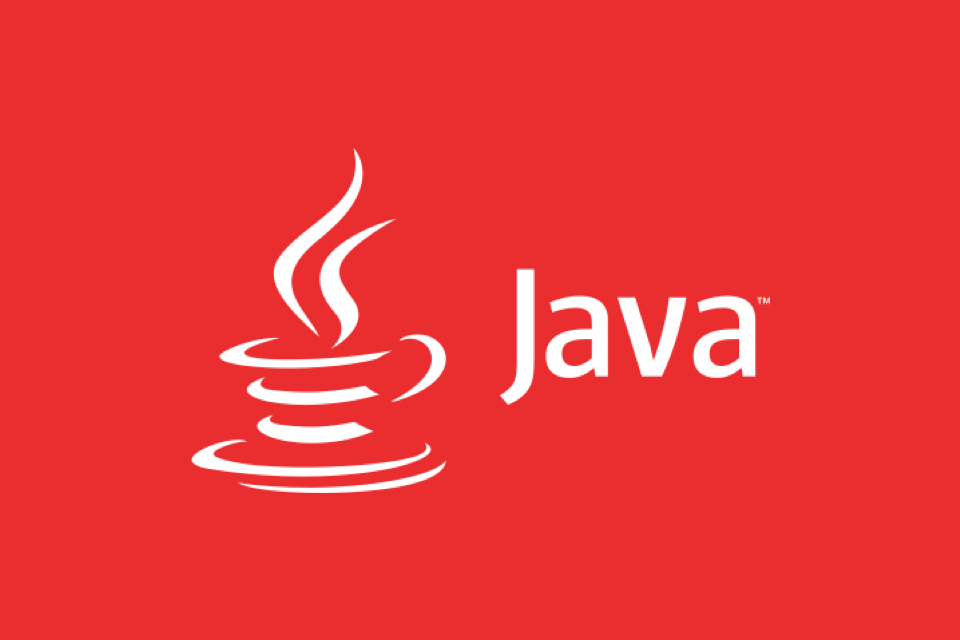
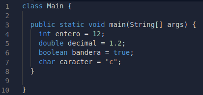
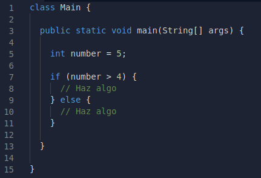
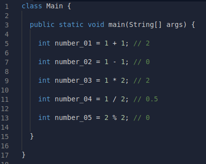

# Basics

## What is it?
> Java is a programming language and computing platform first released in 1995 by Sun Microsystems. There are many applications and websites that will not work unless you have Java installed and more are created every day. Java is fast, safe, and reliable. From laptops to data centers, from game consoles to super computers, from mobile phones to the Internet, Java is everywhere.

## Primitives in Java
When we use Java, we have at our disposal primitives on which our program can be based, which are:
+ **Integer:** It helps us to represent integer values
+ **Double:** It helps us to represent decimal values
+ **Boolean:** It helps us to represent state flags (*true* or *false*)
+ **Char:** It helps us to represent a single character

> **String** isn't considered as a primitve, because it's an array of chars.

## Conditional Statements

In Java, as in almost any other programming language, there are conditionals to fork the flow of the program.

In order to bifurcate the flow of the program we can use the **if** statement, with its respective **else**.

This allows us to execute a block of code only if the condition is met (if), and otherwise execute the next block of code (else), or to continue with the normal flow of the code.

## Operations

The operations in Java, are the same as other languajes. We can add **(+)**, subtract **(-)**, divide **(/)**, multiply **(*)** and get the modulo **(%)**.

[Go Back 🏠](./README.md)
