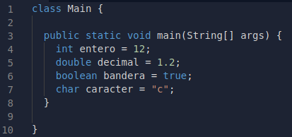
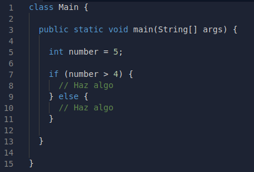
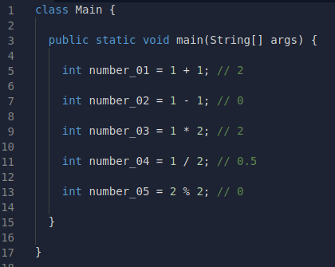

# Java

## ¿Qué es?
> Java es un lenguaje de programación y una plataforma informática comercializada por primera vez en 1995 por Sun Microsystems. Hay muchas aplicaciones y sitios web que no funcionarán a menos que tenga Java instalado y cada día se crean más. Java es rápido, seguro y fiable. Desde portátiles hasta centros de datos, desde consolas para juegos hasta súper computadoras, desde teléfonos móviles hasta Internet, Java está en todas partes.

## Variables primitivas en Java
Cuando usamos Java, tenemos a nuestra disposición primitivos en los cuales se puede basar nuestro programa, los cuales son:
+ **Integer:** Nos sirve para representar valores enteros
+ **Double:** Nos sirve para representar valores de decimales
+ **Boolean:** Nos sirve para representar banderas de estado *true* o *falsa*
+ **Char:** Nos sirve para representar un solo caracter

> **String** no es considerada una variable primitiva, ya que es un array de Chars.

## Sentencias Condicionales

En Java, como en casi cualquier otro lenguaje de progamación, existen condicionales para bifurcar el flujo del programa.

Para poder bifurcar el flujo del programa podemos utilizar la sentencia **if**, con su respectivo **else**.

Esto nos permite ejecutar un bloque de código sólo si la condición se cumple (if), y en caso contrario ejecutar el siguiente bloque de código (else), o bien seguir con el flujo normal del código.

## Operaciones

Las operaciones en Java, son las mismas que en otros lenguajes, ya que podemos sumar **(+)**, restar **(-)**, multiplicar **(*)**, dividir **(/)** y conseguir el módulo **(%)**.

[Regresar 🏠](./README.md)