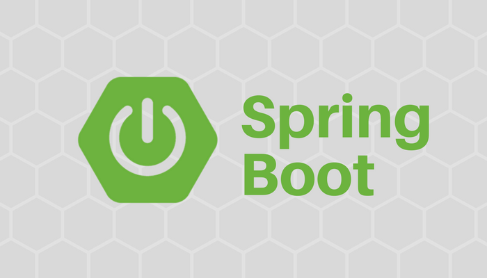

# Spring Boot

## ¿Qué es?

> Spring Boot makes it easy to create stand-alone, production-grade Spring based Applications that you can "just run".

## Spring Core Technologies

Entre las tecnologías que incluye spring se encuentra la **Inversion of Control (IoC)** la cual usa el método de **Dependecy Injection (DI)**, el cual es un proceso en el que los objetos definen sus dependencias mediante argumentos de constructor, argumentos a un método factory o con propiedades que se le colocan después de generar la instancia del objeto.

[Regresar 🏠](./README.md)