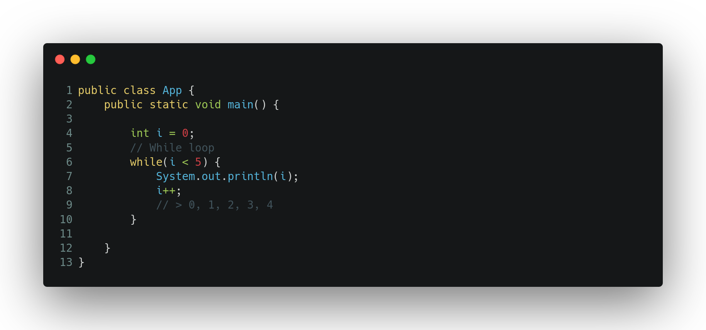
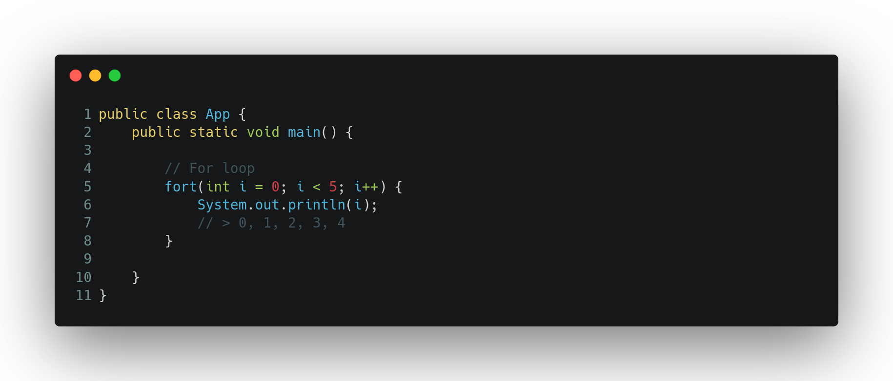

# Loops

We can use loops to get repetitive work done in less code-lines.

### While

The **while loop** receive a condition and loop the code between parenthesis until the condition becomes falsy.

### For

The **for loop** does what the while loop but in a shorthand way.

