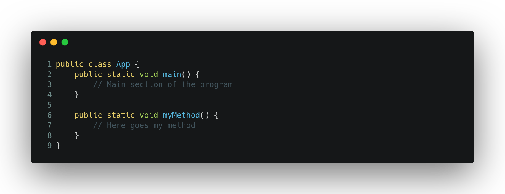
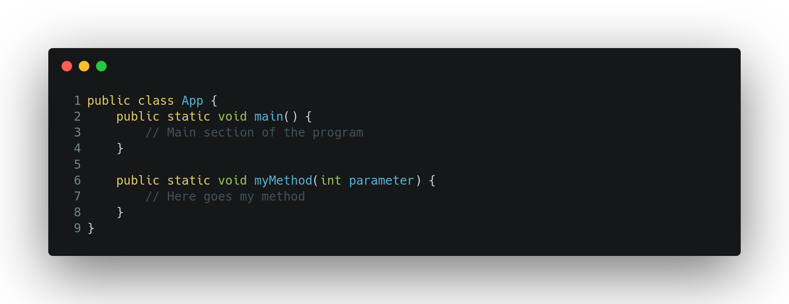
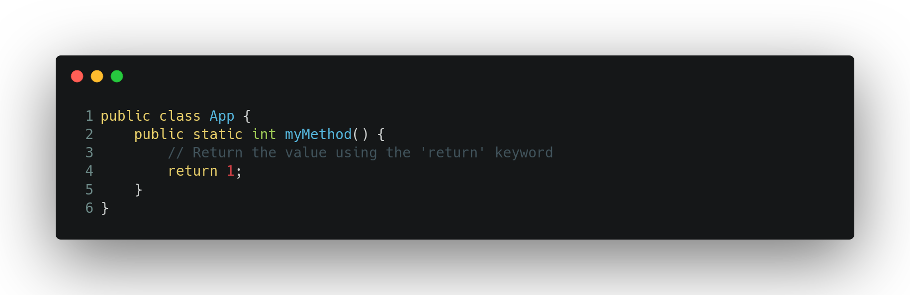

# Methods

A method is a way to encapsulate code to reuse it later. To declare a method it needs to be outside the **main** method.

The method itself can receive parameters (variables):

A method can return a value, you just need to change the **void** part of the **public static void myMethod()** to the type of value your method is going to return. For example:

[Go Back 🏠](./README.md)