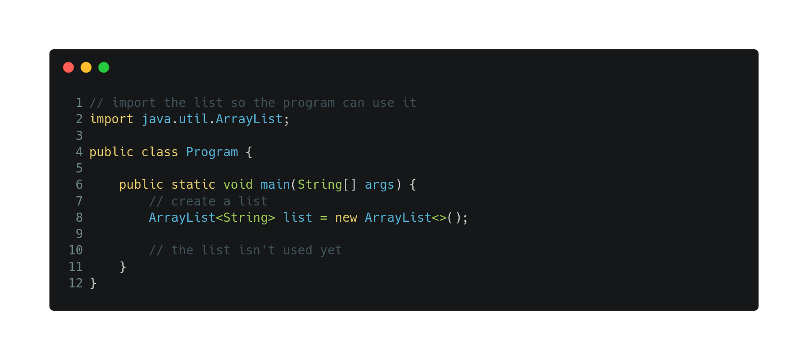
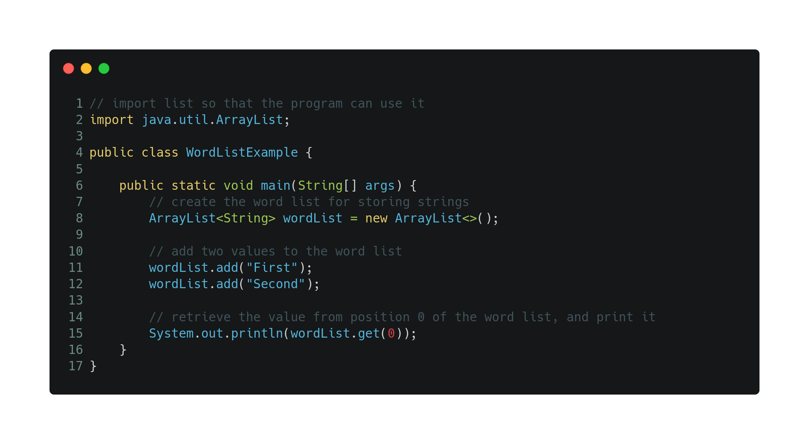
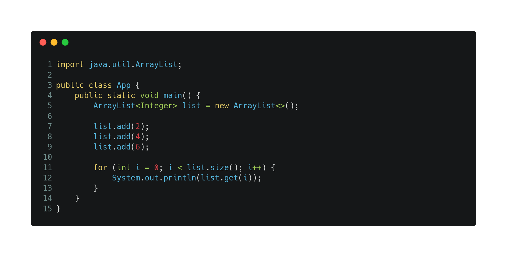

# Lists

When we cant to handle many values, we can't just declare all the variables. Maybe if there were only 3 variables we could declare the three of them but what if we have 1,000 variables? or 50,000?

Getting to the point of managing a huge number of variables makes the standard variable declaration useless, that's why we have *ArrayLists*.

> ArrayList is a pre-made tool that makes easier the job of creating a list in Java.

### How to use ArrayList

To use ArrayList we must first include the command `import java.util.ArrayList;` in our file.

Once imported, you can create a list using `ArrayList<type> list = new ArrayList<>();`

You can add some value to the list by using `<listName>.add(<value>);`, and you can get the value from the list by using `<listName>.get(<id>);`, and finally we can get the size of the list by using `<listName>.size();`.

### Iterating over a list
You can use the traditional **for loop** to iterate the ArrayList. Just remember that a list index start at 0 and that you can get the size of the list by using `<listName>.size()`.

[Regresar 🏠](./README.md)