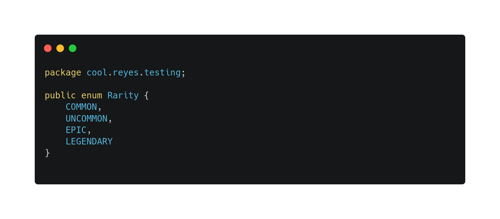
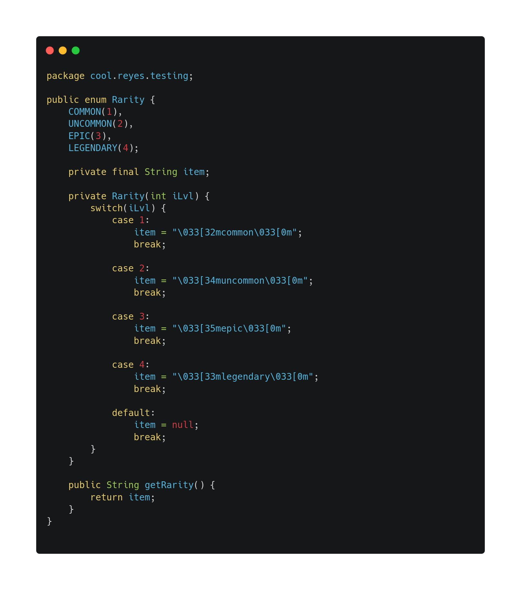

# Enums

An *Enum* is a data type, it consist of a fixed set of constants. It can be used for storing data that will not change, like the *days of the week*, *months of the year*, *math constants*, etc...

> There's a convetion that says we should name constants in `UPPERCASE`.

## Enums constructors

Enums can have a constructor too, it is a little complex to understand how this works but lets analyze the next example:

Every time we use the `Rarity` enum with any of the given values, we're also calling the constructor and passing the value between parenthesis as a parameter.

[Regresar 🏠](./README.md)