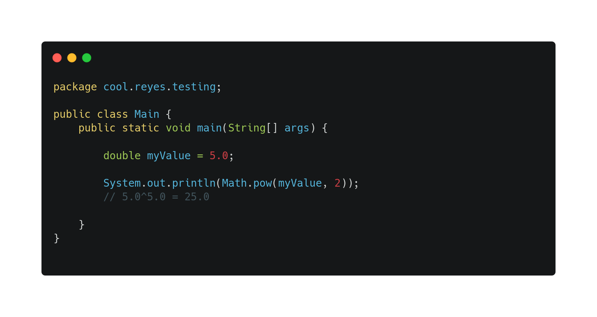
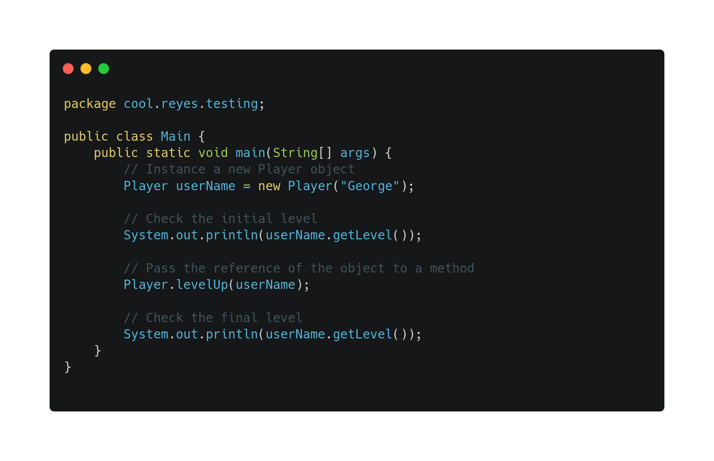

# Value and Reference
When we work with variables we need to understand well the concept of *Value* and *Reference*.

## Value
Every time we work with a value we aren't overwriting the variable value, we just have the value itself handed to the *class*, *method* or *attribute* itself.

In this example, we passed the value that `myValue` holds, but it doesn't affect the value of `myValue` itself.

## Reference
When we use the reference, we use the memory direction where the variable is stored, so in this the value will be modified.

In this other example, we create a instance of a Player class, we check the initial level and then pass the reference of the object to a method. We finally check that the level of that instance was altered.

[Go Back 🏠](./README.md)