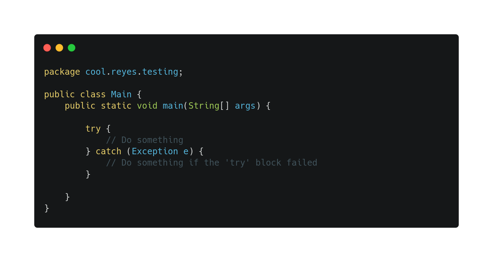

# Try/Catch
The *try/catch* tool serve us to manage the errors our code can have. Imagine that a wrong user input breaks your entire program execution, or that a bad fetching to an API breaks the program too.

This can be managed with the try/catch feature.

> This is the syntax of the `try/catch` tool

[Go Back 🏠](./README.md)